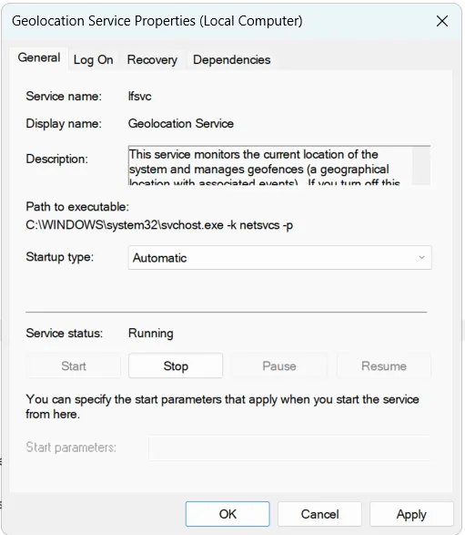

While there are many resources available on optimizing PC performance, I have found that some of them focus on less important or even incorrect details. I say the things that have actually worked for me.

> The credit for this post mostly belongs to Chris Titus Tech, as I sourced much of the information from his YouTube channel. However, I wanted to compile the key points in one place for easy reference and to ensure that I wouldn't forget the important information.

It is worth noting that Windows has multiple places for one thing, which can be confusing and goes against user experience (UX) and software design principles. For example, there are both the old Control Panel and the new Settings app, and the Programs and Features section is separate from the Apps & features section in the new design. This can be frustrating for users, but it seems that Microsoft is working on improving and consolidating these various locations in future updates.

## Metric
To measure our progress and determine how much improvement we have made, we will use the **Process Count** as our metric. This can be found in the Task Manager and is a useful indicator of system performance. Ideally, we want to reduce the process count to around 100 processes.


It is unfortunate that Windows does not offer a central location to disable all unnecessary startup items at once. Instead, we must navigate to four different locations to disable all unnecessary items.

## 1. Disable Windows Startup 
You can disable most items with an **Enabled** status here. However, I left some programs as enabled because I believe they are useful to have at startup.


## 2. Windows Run
To access the startup programs that are not shown in the previous menu, press `Win+R` or type `Run` and then paste each of the following items one by one. From here, you can delete any shortcuts you do not want to run at startup.
```
shell:startup
```

```
shell:common startup
```


## 3. Registry
To open the Registry Editor, type `regedit` in the Run dialogue box and navigate to the following directories. 

Note that you can paste the path directly into the Registry Editor to go directly to the desired location.
```
Computer\HKEY_CURRENT_USER\SOFTWARE\Microsoft\Windows\CurrentVersion\Run
```

```
Computer\HKEY_LOCAL_MACHINE\SOFTWARE\Microsoft\Windows\CurrentVersion\Run
```

From there, you can delete the entries that you think are useless. 

## 4. Task Scheduler
To access the Task Scheduler and disable unnecessary items, follow these steps:

1.  Open the Task Scheduler.
2.  Navigate to the `Task Scheduler Library`.
3.  Right-click on any items that you do not need and select "Disable."

Note: It is important not to delete these items, as they may be recreated. Simply disabling them will prevent them from running.


## 5. Debloat Windows Tool
To use the Windows Utility tool created by Chris Titus Tech, follow these steps:

1.  Open your terminal and enter the following command:

```
irm christitus.com/win | iex
```

2.  This will open the [Chris Titus Tech's Windows Utility](https://github.com/ChrisTitusTech/winutil), which is a great tool that I personally love.

Alternatively, you can try the [XToolbox](https://github.com/xemulat/XToolbox), which is another collection of optimization and tweaking tools for Windows 10 and 11. However, I do not have much experience with this tool.

## 6. Uninstall Useless Applications and features
To access the Windows features and turn them on or off, follow these steps:

1.  Go to the Run dialogue box and enter the following command:

```
appwiz.cpl
```

2.  This will open the Programs and Features window. From here, select the option to "Turn Windows features on or off."
3.  Review the list of features and disable any that you do not need or use.

## 7. Select Performance Mode
Note that the following steps will improve system performance by reducing the visual effects of Windows.

1.  Open the Run dialogue box and enter the following command:

```
sysdm.cpl ,3
```

2.  This will open the System Properties window and automatically select the third tab, which is the Advanced tab.
3.  Under the Performance section, click on the "Settings" button.
4.  In the Performance Options window, you can choose the "Custom" mode and select only the visual effects that you want to keep. Personally, I recommend enabling the "Show thumbnails instead of icons" and "Smooth edges of screen fonts" options, as this can improve the performance of the system without significantly affecting appearance.


## 7- Disable Unnecessary Windows Services
Go to services by typing the following command in the run and sort services by their running status (to see running services). 
```
services.msc
```
Then right click on service name and choose `Properties`. From this page, change `startup type` to manual and stop the service. 

[Here](https://www.groovypost.com/howto/12-windows-10-services-that-are-safe-to-disable/) is a list of less-useful services that you can disable (if you don't need).
## 8- Other Minor Tweaks
- Select Performance Mode in `Power and Sleep Plans`
- Turn off Game Mode

Also, there is a nice tutorial [here (reddit)](https://www.reddit.com/r/Windows11/comments/10bmxy8/fresh_windows_11_install_how_to_optimize_what_to/) on how to disable other useless things in windows and speed it up. 
## Resources 
- [Making Windows Faster without Tools](https://www.youtube.com/watch?v=GOz_foQcPcY)
- [Before you continue to YouTube](https://www.youtube.com/channel/UCg6gPGh8HU2U01vaFCAsvmQ)
- [How to Speed up Windows 10 in 2022 [Effective Methods] | Beebom](https://beebom.com/speed-up-windows-10-2/)